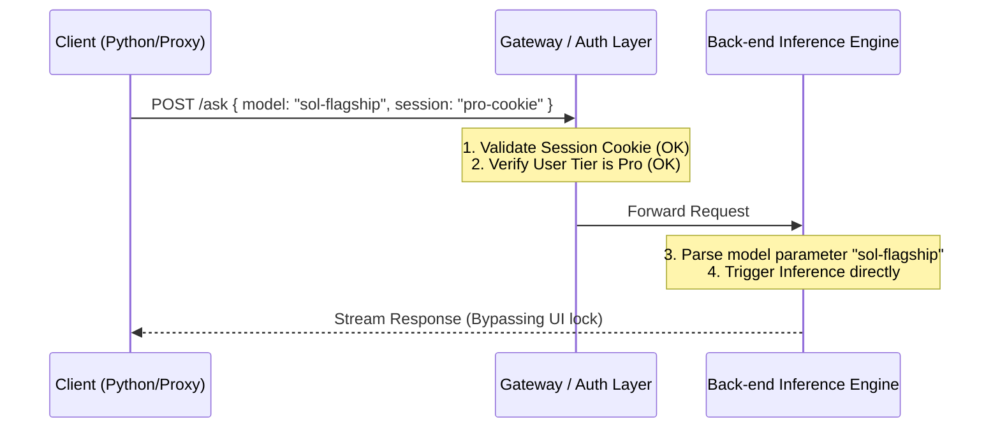

When developing LLM middleware or custom client proxies, auditing upstream interfaces is a necessary step. During a recent reverse engineering and security audit of a mainstream AI search service, I accidentally discovered a classic security flaw: Broken Access Control in business logic.

This design pattern of "blocking the UI, but leaving the API wide open" not only allows regular paid accounts to access expensive large-scale reasoning models that are supposed to be locked, but also rings a warning bell for secure back-end API design.

---

## The Phenomenon: Greyed-out UI vs. Greenlit API

In a recent iteration of the platform, several more expensive, reasoning-heavy models (such as the new flagship Sol model and the Opus reasoning model) were added to the web model selector.

According to their business tiering strategy:
1. **Web UI Behavior**: For basic Pro subscription users, these models are greyed out (Disabled) with a lock icon, prompting the user to upgrade to a higher Max or Enterprise account.
2. **API Endpoint Behavior**: When we extract the valid Session cookies of the Pro account and bypass the front-end UI entirely, sending a JSON Payload directly to the back-end ask endpoint (with `model_preference: "xxx_sol"`), the back-end **successfully accepts and completes the response**.

The response is indeed generated by the requested model, with fast generation, full streaming, and large context windows. The back-end did not block the request, nor did it downgrade the model or return any permission errors.

---

## Technical Cause Analysis

This vulnerability is highly representative in modern fast-iterating SaaS applications. Its core cause can be summarized as: **"Coarse-grained authentication overriding fine-grained authorization"**.



1. **Session Validation Passed**: The gateway first checks the validity of the Cookie/Session, confirming that the user is a logged-in, paying (Pro) user. This is the first line of defense.
2. **Coarse-grained Match**: The back-end logic checks whether "this endpoint allows Pro-level users to call". Since the endpoint is a generic QA endpoint, Pro users are naturally allowed.
3. **Missing Parameter-level Validation**: In the parameter parsing phase, the back-end extracts `model_preference` and passes it straight to the routing/inference queue, **missing the step to check if the specific Model ID is in the current user's whitelist**.
4. **Disconnect between Front-end and Back-end**: The front-end renders dynamically based on Feature Flags, but the back-end lacks a corresponding dynamic Model ID interceptor based on those same Feature Flags.

---

## Remediation and Prevention

As a back-end developer, "never trust front-end restrictions" is a fundamental rule. To fix this parameter-level access control flaw, we can apply the following approaches:

### 1. Implement an Admission Policy Pattern for Models

Explicitly validate the `model_preference` parameter in the request handler/middleware. Map the user's subscription tier to their allowed Model IDs:

```python
# Concept Example: Fine-grained gateway interceptor
def authorize_model_request(user_subscription_tier: str, requested_model: str):
    allowed_models = {
        "free": ["sonar-light"],
        "pro": ["sonar-2", "gpt-5.6-terra", "claude-sonnet-5"],
        "max": ["sonar-2", "gpt-5.6-sol", "claude-opus-4.8"]
    }
    
    if requested_model not in allowed_models.get(user_subscription_tier, []):
        raise HTTPException(
            status_code=403, 
            detail="Model access restricted for your current subscription tier."
        )
```

### 2. Single Source of Truth (SSOT) for UI & Auth

Ensure that both the front-end UI ("grey out/highlight") and the back-end interceptor share a single source of truth. When a model permission is added or removed, it should sync to both components immediately.

---

## Conclusion

Fast-growing AI startups often prioritize feature launches and engineering pipeline speed, leaving gaps in fine-grained billing and multi-tier access control.

For security auditors, looking for such parameter-based bypasses where "the UI locks it, but the API accepts it" remains one of the most effective ways to find business logic flaws. For developers, every input parameter must be treated with the strictness of a security boundary.
