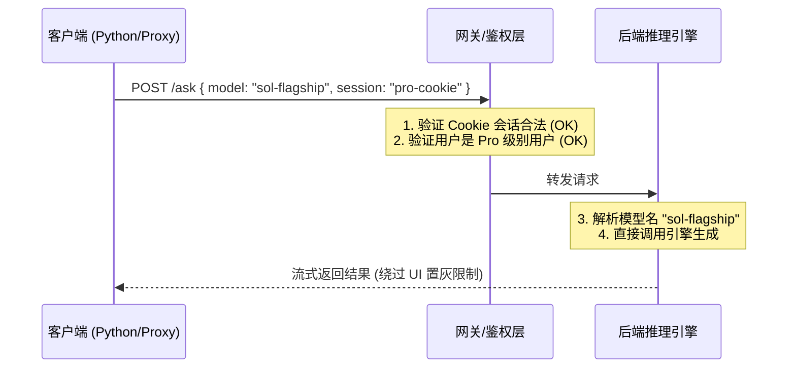

在开发大模型中间件或自定义客户端代理时，审计上游接口是必经之路。在最近对某主流 AI 搜索服务的逆向工程与安全审计中，我无意中发现了一个典型的前后端权限控制不对等（Broken Access Control）的商业逻辑漏洞。

这种“前端防君子，后端防不住”的设计，不仅让普通付费账户得以访问原本被锁定的昂贵大算力模型，也为我们敲响了后端接口安全设计的警钟。

---

## 现象：被置灰的 UI 与绿色的 API

在平台最近的一次版本迭代中，网页端模型选择器中加入了数款更昂贵、具备深度推理能力的大算力模型（如新一代的 Sol 旗舰模型和 Opus 推理模型）。

根据其商业化策略：
1. **网页端 UI 表现**：对于基础的 Pro 订阅用户，这些模型在界面上呈灰色（Disabled）不可选状态，并带有小锁标志，提示用户需要升级为更高等级的 Max 账户或企业账户。
2. **API 接口表现**：当我们提取当前 Pro 账户的有效 Session 会话，绕过网页前端 UI，使用 Python/curl 组装参数，直接向后端核心推理端点发送包含置灰模型 ID（如 `model_preference: "xxx_sol"`）的 JSON Payload 时，后端**成功接受并完成了响应**。

实验结果表明，该 Pro 账户不仅能够调用置灰模型，而且其返回内容、生成速度以及大上下文的流式数据均为真实大模型输出。后端不仅没有阻断这次请求，甚至没有在响应中进行任何关于权限等级不足的降级警告。

---

## 技术成因分析

这一漏洞在现代快速迭代的 SaaS（尤其是大模型相关产品）中非常具有代表性。其核心成因可以总结为：**“粗粒度鉴权覆盖了细粒度鉴权”**。



1. **会话校验通过**：网关首先验证了 Cookie / Session 的有效性，确认用户是一个“已登录且已付费（Pro）”的合法用户。这是第一道防线。
2. **粗粒度级别匹配**：后端逻辑在鉴权时，只判断了“该接口是否允许 Pro 级别以上的用户调用”。由于该接口是通用的问答接口，Pro 用户自然有权访问。
3. **细粒度参数校验缺失**：在参数解析阶段，后端将 `model_preference` 提取出来，直接交给了路由和负载均衡队列，但**遗漏了校验该具体 Model ID 是否在当前用户的付费等级白名单内**。
4. **前后端规则脱节**：前端页面是动态加载且基于 Feature Flags（功能开关）进行 UI 渲染的，而服务端并没有同步实现一套基于 Feature Flags 的模型级动态拦截器。

---

## 防范与修复方案

作为后端开发者，“永远不要信任前端的安全限制”是一条基本铁律。针对这种接口级细粒度权限控制遗漏，可以采取以下方案：

### 1. 引入模型准入策略模式 (Admission Policy)

在问答接口的拦截器（Interceptor/Middleware）中，针对 `model_preference` 字段进行显式鉴权。将用户付费级别与允许调用的 Model ID 列表进行绑定：

```python
# 概念示例：微服务网关中的细粒度拦截
def authorize_model_request(user_subscription_tier: str, requested_model: str):
    allowed_models = {
        "free": ["sonar-light"],
        "pro": ["sonar-2", "gpt-5.6-terra", "claude-sonnet-5"],
        "max": ["sonar-2", "gpt-5.6-sol", "claude-opus-4.8"]
    }
    
    if requested_model not in allowed_models.get(user_subscription_tier, []):
        raise HTTPException(
            status_code=403, 
            detail="Model access restricted for your current subscription tier."
        )
```

### 2. 鉴权与配置下发统一 (SSOT)

让前端 UI 的“置灰/高亮”逻辑与后端的拦截器共享同一个单一数据源（Single Source of Truth）。当后端新增或停用某个用户的模型访问权限时，拦截规则与 UI 状态同步生效，避免两套逻辑各自为政。

---

## 总结

快速增长的 AI 产品往往为了在市场上抢占先机，优先专注于功能的开发与算力管道的打通，而在精细化计费和多级鉴权上留下了漏洞。

对于安全审计人员而言，寻找此类“前端防君子，后端大敞开”的参数越权，依然是发掘商业逻辑漏洞最高效的手段之一。而对于开发者来说，在交付任何暴露在公网的 API 时，都必须在服务端对每一个传入参数做最坏的打算和最严格的边界校验。
